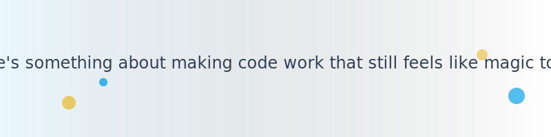

# Thushar Sreenivas
### Senior Frontend Engineer · React, TypeScript, R&D, AI Tooling

<picture><source media="(prefers-color-scheme: dark)" srcset="assets/images/hero-banner-dark.svg"></picture>

<picture><source media="(prefers-color-scheme: dark)" srcset="assets/images/divider-dark.svg"></picture>
<picture><source media="(prefers-color-scheme: dark)" srcset="assets/images/header-journey-dark.svg"></picture>

My adventure through the tech landscape has always been driven by a fascination with the spells we weave into reality. 

At **Pencil**, I crafted the core canvas editor, bringing ideas to life using **React** and **TypeScript**. It wasn't just about placing pixels on a screen; it was about building intuitive experiences where users could manipulate space effortlessly. Along the way, I built plugins for **Figma** and **Photoshop** that bridged the gap between design and development, automating away the tedious parts of the creative process.

When I journeyed to **Surge** (Sequoia), the challenge evolved. I architected mobile media experiences with **React Native**, ensuring that performance and fluidity felt completely native to the device. Mobile development taught me that the best magic is the kind users never even notice because it just works perfectly.

Later, I delved into the deep backend with **Crypto** vaults, writing robust and highly concurrent systems in **Go**. This taught me the importance of reliability and safety when dealing with complex, high-stakes infrastructure.

<picture><source media="(prefers-color-scheme: dark)" srcset="assets/images/divider-dark.svg"></picture>
<picture><source media="(prefers-color-scheme: dark)" srcset="assets/images/header-grimoire-dark.svg"></picture>

<picture><source media="(prefers-color-scheme: dark)" srcset="assets/images/grimoire-frontend-dark.svg"></picture>
<picture><source media="(prefers-color-scheme: dark)" srcset="assets/images/grimoire-backend-dark.svg"></picture>
<picture><source media="(prefers-color-scheme: dark)" srcset="assets/images/grimoire-tooling-dark.svg"></picture>

Beyond product development, my true passion lies in developer **tooling**, **automation**, and creating **AI** workflows. I love building the tools that help other developers write better code faster. Whether it's crafting sophisticated GitHub Actions to automate CI/CD pipelines or exploring new AI-assisted coding methodologies, I am always expanding my grimoire.

<picture><source media="(prefers-color-scheme: dark)" srcset="assets/images/divider-dark.svg"></picture>
<picture><source media="(prefers-color-scheme: dark)" srcset="assets/images/header-contact-dark.svg"></picture>

If you'd like to collaborate, talk about front-end architecture, or share a bit of magic, you can reach me through these channels:

- Let's connect on [LinkedIn](https://linkedin.com/in/thusharsreenivas)
- Check out my open-source spells on [GitHub](https://github.com/thusharsreenivas)
- Or simply send a direct message via [Email](mailto:hello@example.com)

<picture><source media="(prefers-color-scheme: dark)" srcset="assets/images/footer-dark.svg"></picture>